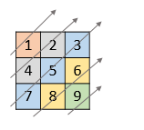
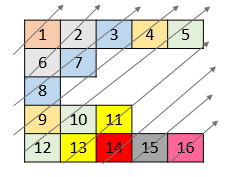
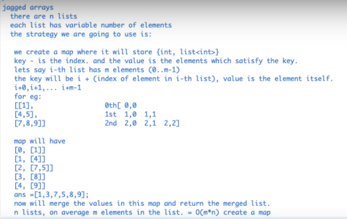
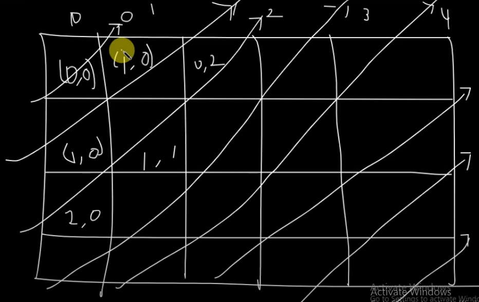
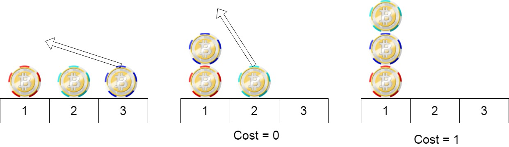
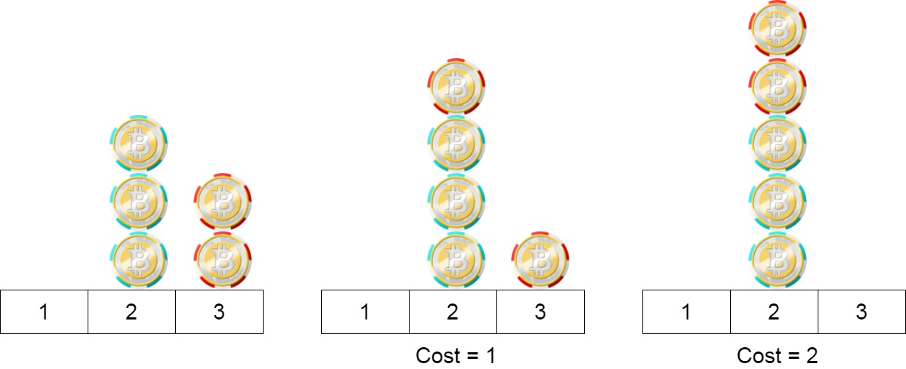
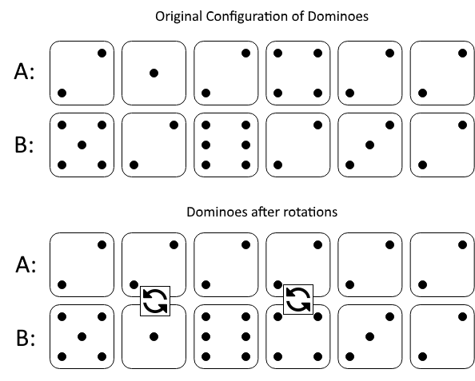

# **day - 1**

## **1424. Diagonal Traverse II**

Given a list of lists of integers, nums, return all elements of nums in diagonal order as shown in the below images.

**Example 1:**



```
Input: nums = [[1,2,3],[4,5,6],[7,8,9]]
Output: [1,4,2,7,5,3,8,6,9]
```

**Example 2:**



```
Input: nums = [[1,2,3,4,5],[6,7],[8],[9,10,11],[12,13,14,15,16]]
Output: [1,6,2,8,7,3,9,4,12,10,5,13,11,14,15,16]
```

**Example 3:**

```
Input: nums = [[1,2,3],[4],[5,6,7],[8],[9,10,11]]
Output: [1,4,2,5,3,8,6,9,7,10,11]
```

**Example 4:**

```
Input: nums = [[1,2,3,4,5,6]]
Output: [1,2,3,4,5,6]
```

**Constraints:**

```
1 <= nums.length <= 10^5
1 <= nums[i].length <= 10^5
1 <= nums[i][j] <= 10^9
There at most 10^5 elements in nums.
```

**Hints**

- Notice that numbers with equal sums of row and column indexes belong to the same diagonal.
- Store them in tuples (sum, row, val), sort them, and then regroup the answer.

### **Intuition 1**

- start a loop for the length of the 2d array.
- go daigonally towards top right for each element in the length loop

```
class Solution {
public:
    vector<int> findDiagonalOrder(vector<vector<int>>& nums) {
        int rows = nums.size();
        if(rows == 1){
            return nums[0];
        }
        int cols;
        vector<int> res;
        for(auto i = 0; i < rows; i++){
            auto j = 0;
            auto k = i;
            while(k>=0){
                cols = nums[k].size();
                if(j<cols){
                    res.push_back(nums[k][j]);
                }
                k--;
                j++;
            }
        }
        cols = nums[rows-1].size();
        for(auto j = 1; j < cols; j++){
            auto k = j;
            auto i = rows-1;
            auto innerCols = nums[i].size();
            while(k<innerCols){
                if(i>=0){
                    res.push_back(nums[i][k]);
                }
                i--;
                k++;
                innerCols = nums[i].size();
            }
        }
        return res;
    }
};
```

- issue with the approach, we miss the cases where the elements go beyond the active daigonal

```
[[1,2,3,4,5,6,7,8,9]
[10,11,12]
[13,14]]
```

**Approach 2**

- create a map of diagonal (i.e i+j and the list of values associated with that daigonal)



```
class Solution {
public:
    vector<int> findDiagonalOrder(vector<vector<int>>& nums) {
        int n = nums.size();
        unordered_map<int,vector<int>> um;
        for(int i=n-1;i>=0;i--){
            for(int j=0;j<nums[i].size();j++){
                um[i+j].push_back(nums[i][j]);
            }
        }
        vector<int> ans;
        for(int i=0;i<um.size();i++){
            for(int j=0;j<um[i].size();j++){
                ans.push_back(um[i][j]);
            }
        }
        return ans;
    }
};
```

**Approach 3**

- all the elements in daigonal will have the sum of i and j as equal
- leverage the above fact and then sort the elements according to the above facts



```
class Solution {
public:
    vector<int> findDiagonalOrder(vector<vector<int>>& nums) {
        int n = nums.size();
        vector<vector<int>> arr;
        for(int i=0;i<n;i++){
            for(int j=0;j<(int)nums[i].size();j++){
                arr.push_back({i+j,j,nums[i][j]});
            }
        }
        vector<int> ans;
        sort(arr.begin(),arr.end());
        for(int i=0;i<(int)arr.size();i++){
            ans.push_back(arr[i][2]);
        }
        return ans;
    }
};
```

## **1217. Minimum Cost to Move Chips to The Same Position**

We have n chips, where the position of the ith chip is position[i].

We need to move all the chips to the same position. In one step, we can change the position of the ith chip from position[i] to:

position[i] + 2 or position[i] - 2 with cost = 0.
position[i] + 1 or position[i] - 1 with cost = 1.
Return the minimum cost needed to move all the chips to the same position.

**Example 1:**

Input: position = [1,2,3]
Output: 1
Explanation: First step: Move the chip at position 3 to position 1 with cost = 0.
Second step: Move the chip at position 2 to position 1 with cost = 1.
Total cost is 1.

**Example 2:**



```
Input: position = [2,2,2,3,3]
Output: 2
Explanation: We can move the two chips at position  3 to position 2. Each move has cost = 1. The total cost = 2.
```

**Example 3:**

```
Input: position = [1,1000000000]
Output: 1
```

**Constraints:**

```
1 <= position.length <= 100
1 <= position[i] <= 10^9
```

**Hints**

- The first move keeps the parity of the element as it is.
- The second move changes the parity of the element.
- Since the first move is free, if all the numbers have the same parity, the answer would be zero.
- Find the minimum cost to make all the numbers have the same parity.

**Approach 1:**
Moving Chips Cleverly
Intuition

Notice that we have two types of costs:

```
Costs 0 when moving to position[i] + 2 or position[i] - 2.
Costs 1 when moving to position[i] + 1 or position[i] - 1.
```

- Since move to position[i] + 2 or position[i] - 2 is free, it is natural to think that firstly moving chips as close as possible, with 0 cost.

- In fact, we can move all chips at even positions to position 0, and move all chips at the odd positions to position 1.

- Then, we only have many chips at position 0 and other chips at position 1. Next, we only need to move those two piles together.

- Given two piles of chips located at 0 and 1 respectively, intuitively it would be less effort-taking (i.e. less cost) to move the smaller pile to the larger one, which makes the total cost to:

```
Cost = min(even_cnt, odd_cnt)
```

- where even_cnteven_cnt represents the number of chips at the even positions, and odd_cntodd_cnt represents the number of chips at the odd positions.

- As for the final position of those chips pile, there are only two possibilities:

- The final position is at the even position, or
  The final position is at the odd position.
  In the first case, we at least need to cost odd_cnt to move all the chips at the odd positions to the even positions. Similarly, in the second case, we at least need to cost even_cnt.

```
Therefore, min(even_cnt, odd_cnt) is the smallest possible cost.
```

**Algorithm**

`We just need to count the number of chips at the even positions and the number of chips at the odd positions and return the smaller one.`

```
class Solution {
public:
    int minCostToMoveChips(vector<int>& position) {
        int even=0,odd=0;
        for(auto i:position){
            if(i%2==0){
                even++;
            }
            else{
                odd++;
            }
        }
        return min(even, odd);
    }
};
```

## **1007. Minimum Domino Rotations For Equal Row**

In a row of dominoes, A[i] and B[i] represent the top and bottom halves of the ith domino. (A domino is a tile with two numbers from 1 to 6 - one on each half of the tile.)

We may rotate the ith domino, so that A[i] and B[i] swap values.

Return the minimum number of rotations so that all the values in A are the same, or all the values in B are the same.

If it cannot be done, return -1.

**Example 1:**



```
Input: A = [2,1,2,4,2,2], B = [5,2,6,2,3,2]
Output: 2
```

**Explanation:**

```
The first figure represents the dominoes as given by A and B: before we do any rotations.
If we rotate the second and fourth dominoes, we can make every value in the top row equal to 2, as indicated by the second figure.
```

**Example 2:**

```
Input: A = [3,5,1,2,3], B = [3,6,3,3,4]
Output: -1
```

**Explanation:**

```
In this case, it is not possible to rotate the dominoes to make one row of values equal.
```

**Constraints:**

```
2 <= A.length == B.length <= 2 \* 104
1 <= A[i], B[i] <= 6
```

**Intuition 1**

- The only possible combinations for any side of domino is [1,2,3,4,5,6]
- We can check if these 6 values are possible values to form full row on either A or B

```
class Solution {
public:
    int minDominoRotations(vector<int>& A, vector<int>& B) {
        int minSwaps=INT_MAX;
        for(int i=1;i<=6;i++){
            int swaps = domSwaps(i,A,B);
            minSwaps = min(minSwaps, swaps);
            swaps = domSwaps(i,B,A);
            minSwaps = min(minSwaps, swaps);
            // cout<<"Min Swaps for "<<i<<" : "<<swaps<<"\n";
        }
        return minSwaps==INT_MAX?-1:minSwaps;
    }

    int domSwaps(int target, vector<int>& A, vector<int>& B){
        int swaps = 0;
        for(int i=0;i<A.size();i++){
            if(A[i]!=target && B[i]!=target){
                return INT_MAX;
            }
            else if(A[i]!=target&&B[i]==target){
                swaps++;
            }
        }
        return swaps;
    }
};
```

**Intuition 2**

- A better approach would be to restrict to 4 possibilities:
  - A[0] in A
  - A[0] in B
  - B[0] in A
  - B[0] in A

```
class Solution {
public:
    int minDominoRotations(vector<int>& A, vector<int>& B) {
        int minSwaps=INT_MAX;
        minSwaps = min(minSwaps, domSwaps(A[0],A,B));
        minSwaps = min(minSwaps, domSwaps(B[0],A,B));
        minSwaps = min(minSwaps, domSwaps(A[0],B,A));
        minSwaps = min(minSwaps, domSwaps(B[0],B,A));
        return minSwaps==INT_MAX?-1:minSwaps;
    }

    int domSwaps(int target, vector<int>& A, vector<int>& B){
        int swaps = 0;
        for(int i=0;i<A.size();i++){
            if(A[i]!=target && B[i]!=target){
                return INT_MAX;
            }
            else if(A[i]!=target&&B[i]==target){
                swaps++;
            }
        }
        return swaps;
    }
};
```

## **1099. Two Sum Less Thank K**

Given an array A of integers and integer K, return the maximum S such that there exists i < j with A[i] + A[j] = S and S < K. If no i, j exist satisfying this equation, return -1

**Example 1:**

```
Input: A = [34,23,1,24,75,33,54,8], K = 60
Output: 58
Explanation:
We can use 34 and 24 to sum 58 which is less than 60.
```

**Example 2:**

```
Input: A = [10,20,30], K = 15
Output: -1
Explanation:
In this case it's not possible to get a pair sum less that 15.
```

**Note:**

```
1. l <= A.length <= 100
2. 1 <= A[i] <= 1000
3. 1 <= K <= 2000
```

**Approach 1**

- We do double loop to check for all the possible combination of the two elements which sum is less than K, and we keep the check of such max sum which is less than K

- Time Complexity : O(n2)

**Approach 2**

- Two pointer approach
- Sort and then add a pointer at start and at end and then inc and dec it to get the closest max less than K.

```
class Solution {
public:
    int twoSumLessThanK(vector<int>& A, int K) {
        int maxSum = INT_MIN;
        int left = 0;
        int right = A.size()-1
        while(left<right){
            int twoSum = A[left] + A[right];
            if(twoSum < K && twoSum > maxSum){
                maxSum = twoSum;
            }
            else if(twoSum >= K){
                right--;
            }
            else{
                left++;
            }
        }
        return maxSum == INT_MIN ? -1 : maxSum;
    }
};
```

## **1010. Pairs of Songs With Total Durations Divisible by 60**

You are given a list of songs where the ith song has a duration of time[i] seconds.

Return the number of pairs of songs for which their total duration in seconds is divisible by 60. Formally, we want the number of indices i, j such that i < j with (time[i] + time[j]) % 60 == 0.

**Example 1:**

```
Input: time = [30,20,150,100,40]
Output: 3
```

**Explanation:**

```
Three pairs have a total duration divisible by 60:
(time[0] = 30, time[2] = 150): total duration 180
(time[1] = 20, time[3] = 100): total duration 120
(time[1] = 20, time[4] = 40): total duration 60
```

**Example 2:**

```
Input: time = [60,60,60]
Output: 3
```

**Explanation: **

```
All three pairs have a total duration of 120, which is divisible by 60.
```

**Constraints:**

```
1 <= time.length <= 6 * 104
1 <= time[i] <= 500
```

**Hints:**

- We only need to consider each song length modulo 60.
- We can count the number of songs with (length % 60) equal to r, and store that in an array of size 60.

**Approach 1**

- Find the combination of all the songs with double loop

**Approach 2**

- create an array of 60 and then store the freq of songs with **time % 60** .
- Itterate through the vector again and find the **[60 - (i % 60)]** index and add that to totalcount.

```
class Solution {
public:
    int numPairsDivisibleBy60(vector<int>& time) {
        int totalPairs=0;
        vector<int> v(60,0);
        for(int i=0;i<time.size();i++){
            int m=time[i]%60;
            if(m==0){
                totalPairs+=v[0];
            }
            else if(v[60-m]!=0){
                totalPairs+=v[60-m];
            }
            v[m]++;
        }
        return totalPairs;
    }
};
```
